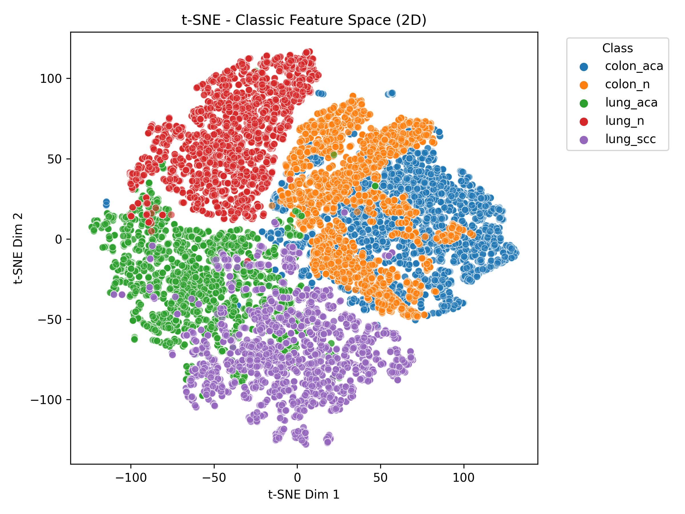
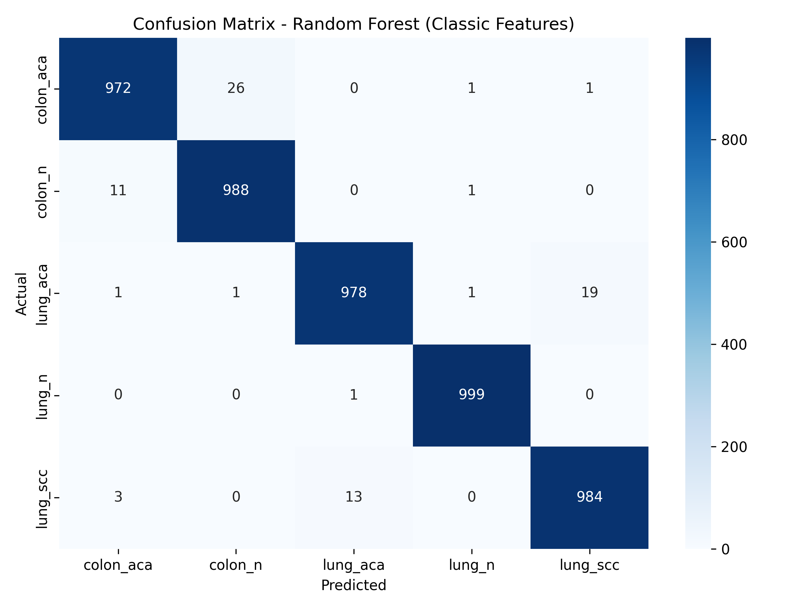
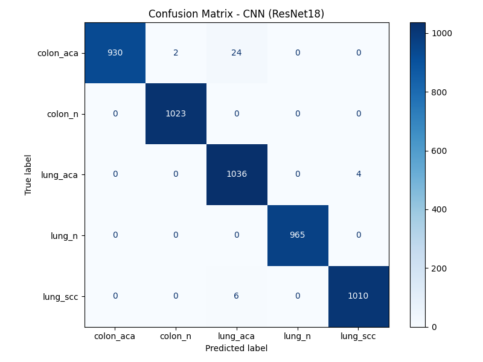
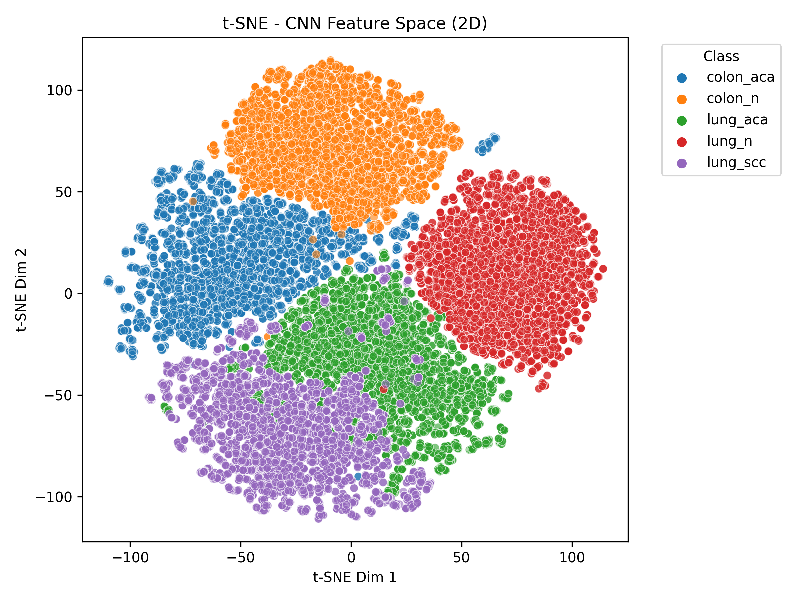
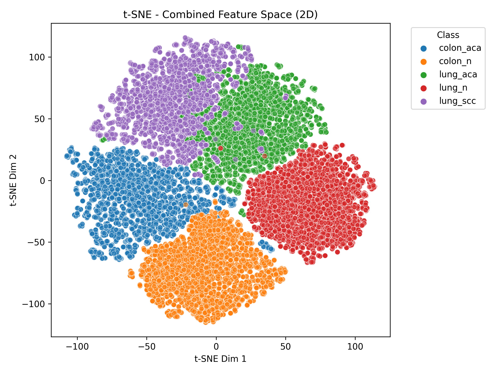
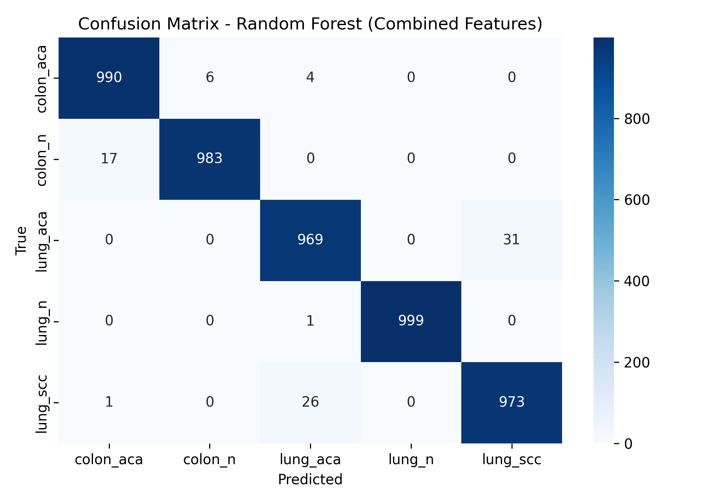

# 🧬 Histopathology Image Classification Case Study (LC25000)

This case study explores the classification of histopathology images from lung and colon tissues using classical image processing and CNN-based deep features. We build and evaluate models based on classical features, CNN features, and a hybrid approach combining both.

---

## 📁 Project Structure

```
project_case_study/
├── data/
│   ├── images/
│   ├── features_classic.csv
│   ├── features_cnn.csv
│   ├── combined_classic_cnn_features.csv
├── models/
│   ├── rf_model_classic.joblib
│   ├── rf_model_combined.joblib
│   └── cnn_model.h5
├── figures/
│   ├── fig_raw_tissue_examples.png
│   ├── fig_preprocessing_demo.png
│   ├── tsne_classic_features.png
│   ├── tsne_cnn_features.png
│   ├── tsne_combined_features.png
│   ├── confusion_matrix_rf_classic.png
│   ├── confusion_matrix_cnn.png
│   ├── confusion_matrix_rf_combined.png
│   
├── src/
│   ├── 
│   ├── 01_visualize_raw_image_classes.py
│   ├── 02_preprocessing_visualization.py
│   ├── 03_preprocess_extract_image_features.py
│   ├── 04_visualize_tsne_classic.py
│   ├── 05_train_rf_classic.py
│   ├── 06_train_cnn_resnet.py
│   ├── 07_extract_cnn_features_and_merge.py
│   ├── 08_tsne_cnn_features.py
│   ├── 09_tsne_combined_features.py
│   └── 10_train_rf_combined.py
├── requirements.txt
└── README.md
```

---

## 📁 Dataset

The dataset used in this case study is publicly available on Kaggle:

🔗 [Lung and Colon Cancer Histopathological Images](https://www.kaggle.com/datasets/andrewmvd/lung-and-colon-cancer-histopathological-images)

You must download the dataset manually from Kaggle and place it in the `data/` directory before running the code.


## 🧭 Workflow Summary

### Raw Image Visualization
Representative images (1 per class):


---

### Preprocessing Demo
Classic image processing techniques:

- Row 1: Raw image
- Row 2: Contrast-enhanced
- Row 3: Noise-reduced


---

### Classical Feature Extraction + t-SNE

Classical features: LBP, GLCM, and texture statistics.  
Visualization using t-SNE:



---

### Random Forest with Classical Features

Confusion matrix for RF model trained only on classical features:



---

### CNN (ResNet18) Image Classification

CNN trained directly on raw images.  
Model trained using transfer learning with ResNet18.



---

### CNN Feature Extraction + t-SNE

t-SNE visualization of high-level CNN embeddings:



---

### Merging CNN + Classical Features + t-SNE

Features from both domains were concatenated and visualized:



---

### Final Random Forest on Combined Features

Highest classification accuracy using combined feature set:




---

## 📝 Dataset

- **Name**: LC25000 Histopathology Dataset
- **Classes**: colon_aca, colon_n, lung_aca, lung_n, lung_scc
- **Size**: 25,000 images (5 classes, 5,000 each)

---

## 🚀 Reproducibility

- All source code in `src/`
- Tested on Google Cloud VM with NVIDIA T4 GPU
- Python ≥ 3.8, see `requirements.txt`

---

## 📌 Notes

- Classical and CNN approaches were compared on equal footing.
- The hybrid model leverages complementary strengths of both.

---

## 📷 GitHub Tip

To preview figures directly:
- Make sure images are committed under the `figures/` directory.
- Use standard markdown syntax like:
```markdown

```
GitHub will render these in the README automatically.

---

## 🙌 Acknowledgements

- Dataset: [LC25000 - Kaggle](https://www.kaggle.com/datasets/andrewmvd/lung-and-colon-cancer-histopathological-images)

---
>>>>>>> 6650c4e (Initial commit: Add all files)
